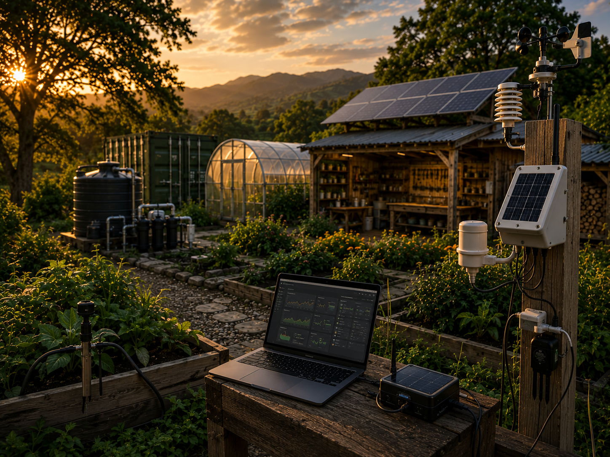
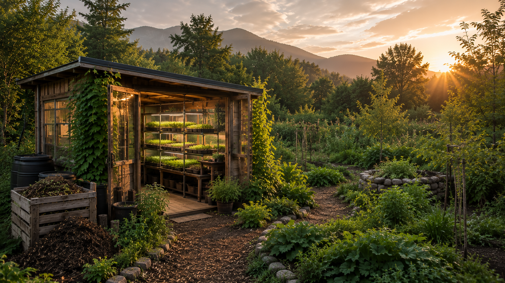
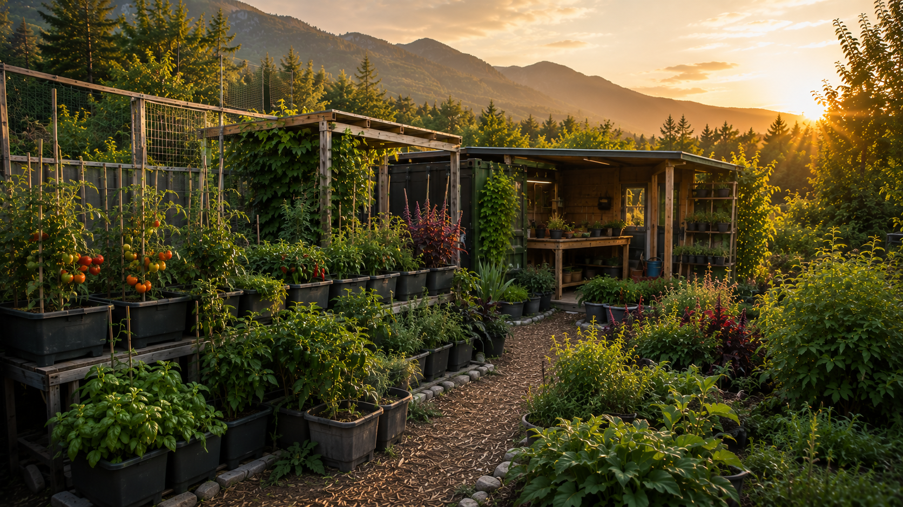
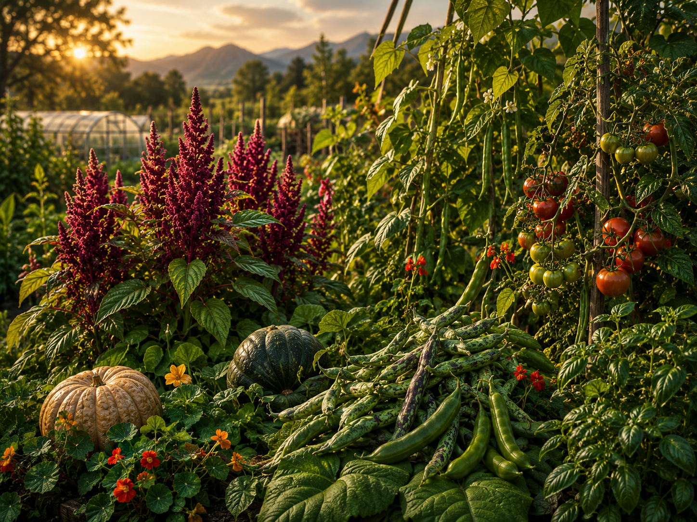
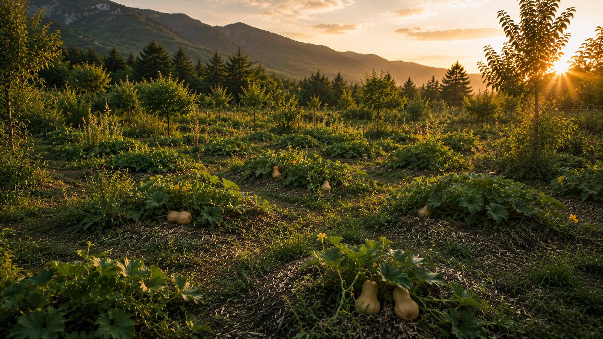
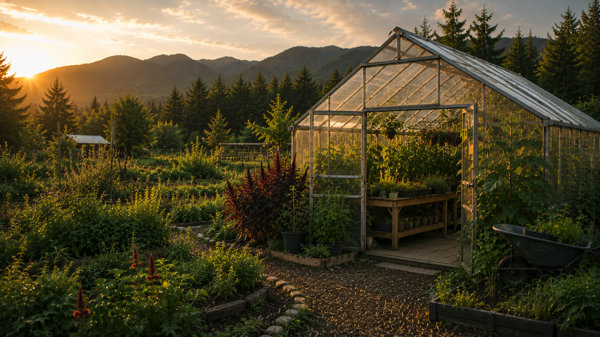
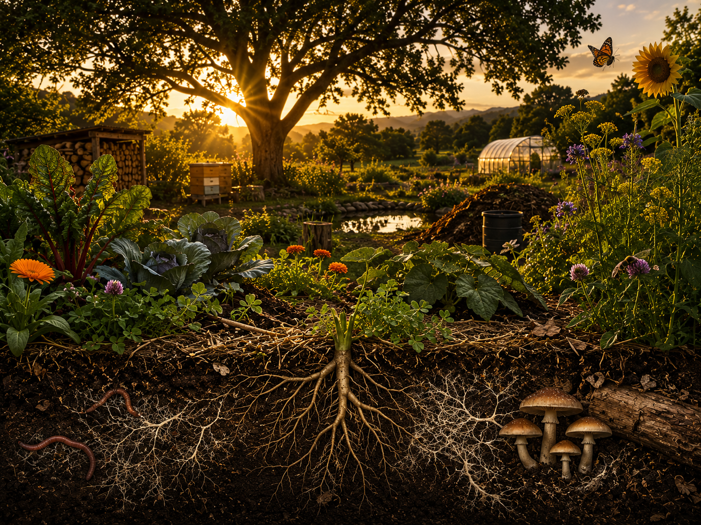
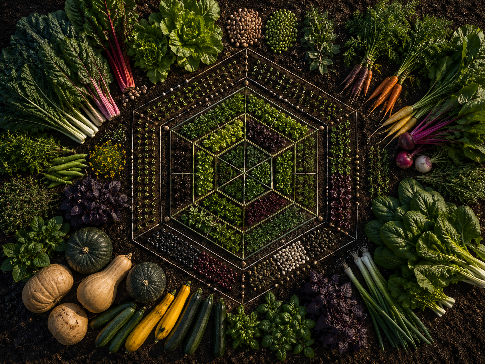

# NoMad's Farm

  <section class="ew-landing-hero">
    

      
Zen and the Art of Nomad Farming

      <h1>NoMad's Farm</h1>
      
Growing food. Restoring soil. Building resilient systems.

      
A practical documentation hub for regenerative agriculture, balcony production, protected cultivation, field trials, monitoring and long-term learning.

      

        <a class="ew-btn ew-btn-primary" href="app/">Open Plant Inventory App</a>
        <a class="ew-btn ew-btn-secondary" href="projects/">Open Projects</a>
        <a class="ew-btn ew-btn-secondary" href="plants/crop-matrix/">Open Crop Matrix</a>
      

    

  </section>

  <section class="ew-start" aria-label="Start here">
    

      
Start here

      <h2>Use the site as a working system.</h2>
      
Start from the plant inventory app or the project registry, then move into active project pages, observations and knowledge sections. Projects are nested work streams, not a flat pile of links, because apparently navigation should not be a compost heap.

    

    <ol>
      <li><a href="app/">Open the plant inventory app</a></li>
      <li><a href="projects/">Open the project registry</a></li>
      <li><a href="projects/balcony-pot-house/">Review Balcony Pot House</a></li>
      <li><a href="projects/sprout-lab/">Review Sprout Lab</a></li>
      <li><a href="plants/crop-matrix/">Compare crops</a></li>
    </ol>
  </section>

  <section class="ew-section-block" aria-label="Active projects">
    
Active projects

    

      <a class="ew-feature" href="app/">
        
        
Operations<h2>Plant Inventory App</h2>
NMS-style plant inventory with map markers, asset records, logs, radar charts, topology and weather context.
<strong>Open App</strong>

      </a>

      <a class="ew-feature" href="projects/sprout-lab/">
        
        
Indoor production<h2>Sprout Lab</h2>
Sprouts, microgreens, seed viability and year-round propagation workflow.
<strong>Open Sprout Lab</strong>

      </a>

      <a class="ew-feature" href="projects/microclimate-lab/">
        
        
Monitoring<h2>Microclimate Lab</h2>
Temperature, humidity, airflow, light and sensor placement for small growing systems.
<strong>Open Microclimate Lab</strong>

      </a>

      <a class="ew-feature" href="projects/balcony-pot-house/">
        
        
Container production<h2>Balcony Pot House</h2>
South-East balcony system with tomatoes, peppers, beans, herbs, sweet potato and volunteer selection.
<strong>Open Balcony Pot House</strong>

      </a>

      <a class="ew-feature" href="projects/gaitanevo-2026/">
        
        
Field work<h2>Gaitanevo 2026</h2>
Outdoor crop observation, biomass production, soil building and low-input field routines.
<strong>Open Gaitanevo 2026</strong>

      </a>

      <a class="ew-feature" href="projects/no-maintenance-squash/">
        
        
Field trial<h2>No-Maintenance Squash Trial</h2>
Scattered squash pits for low-labor production, moisture retention and production-per-visit data.
<strong>Open Squash Trial</strong>

      </a>

      <a class="ew-feature" href="projects/greenhouse-2026/">
        
        
Protected cultivation<h2>Greenhouse 2026</h2>
Protected growing system with lapad, nettle, amaranth, seed production and biomass cycles.
<strong>Open Greenhouse 2026</strong>

      </a>
    

  </section>

  <section class="ew-section-block" aria-label="Primary knowledge">
    
Primary knowledge

    

      <a class="ew-feature ew-feature-large" href="knowledge/">
        
        
Knowledge base<h2>Knowledge Base</h2>
Seedlings, pruning, squash pot notes and source hierarchy.
<strong>Open Knowledge Base</strong>

      </a>

      <a class="ew-feature ew-feature-large" href="plants/plant-profiles/">
        
        
Plant knowledge<h2>Plants & Profiles</h2>
Detailed guides for crops we grow and test: amaranth, squash, beans, cover crops and more.
<strong>Browse Plants</strong>

      </a>

      <a class="ew-feature ew-feature-large" href="plants/crop-matrix/">
        
        
Decision support<h2>Crop Matrix</h2>
Compare crops across criteria, strengths, trade-offs and use cases.
<strong>Open Matrix</strong>

      </a>
    

  </section>

  <section class="ew-principles-panel">
    
    

      
Plant operations

      <h2>Inventory first, then observations.</h2>
      
Plant assets, plots, telemetry links, event logs and field context are tracked in the standalone app.

      <a class="ew-btn ew-btn-primary" href="app/">Open Plant Inventory App</a>
    

  </section>

