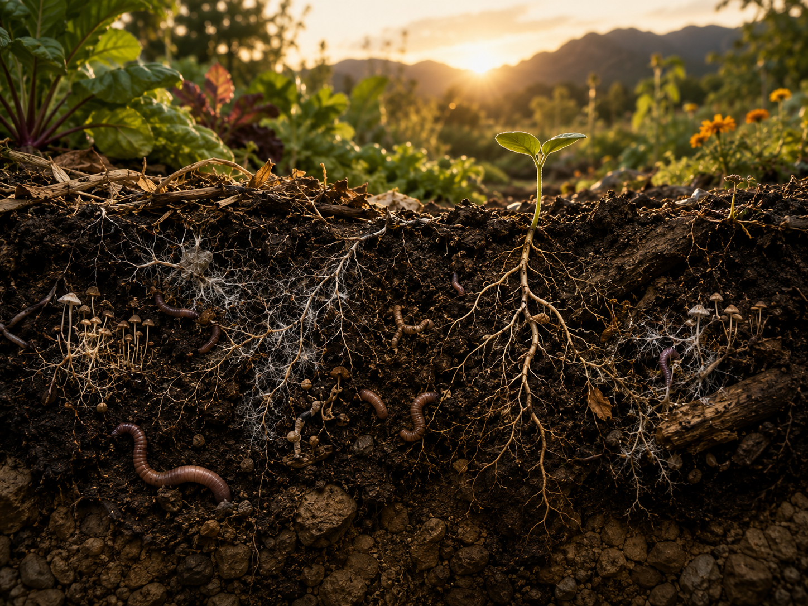
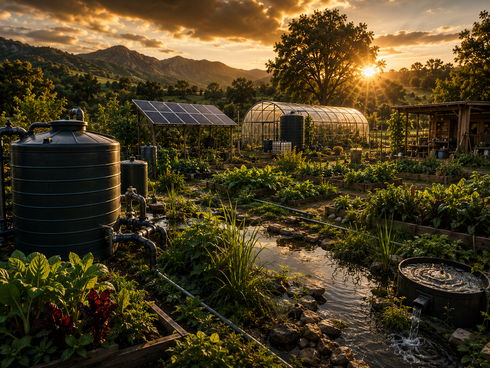
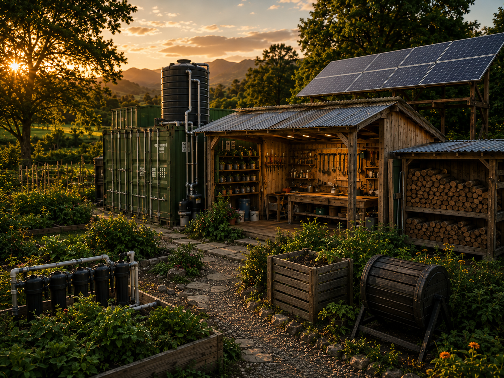
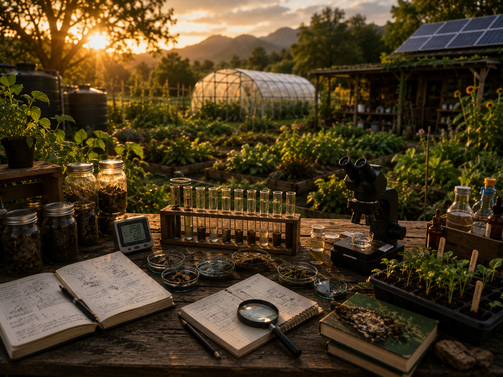
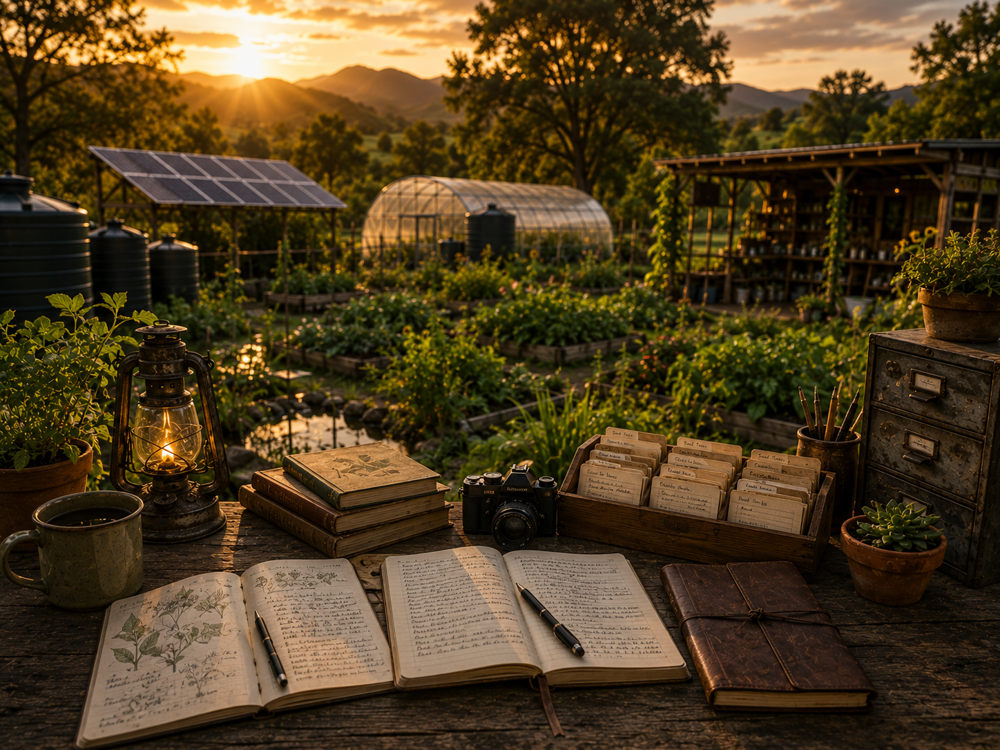
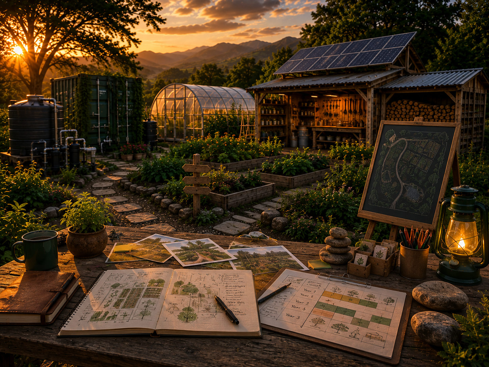

# Earth Work

  <section class="ew-landing-hero">
    

      
Growing systems. Deploying solutions.

      <h1>Earth Work</h1>
      
Growing food. Restoring soil. Building resilient systems.

      
A practical documentation hub for regenerative agriculture, soil recovery, resilient infrastructure, sensors, experiments and long-term field work.

      

        <a class="ew-btn ew-btn-primary" href="project/overview/">Explore the project</a>
        <a class="ew-btn ew-btn-secondary" href="plants/crop-matrix/">Open crop matrix</a>
      

    

  </section>

  <section class="ew-start" aria-label="Start here">
    

      
Start here

      <h2>Follow the project path.</h2>
      
New visitors should start with the overview, then move through the roadmap, crop decisions and active experiments.

    

    <ol>
      <li><a href="project/overview/">Understand the project</a></li>
      <li><a href="project/three-year-plan/">Review the 3-year plan</a></li>
      <li><a href="plants/crop-matrix/">Compare crops</a></li>
      <li><a href="experiments/greenhouse-2026/">Follow experiments</a></li>
    </ol>
  </section>

  <section class="ew-section-block" aria-label="Primary knowledge">
    
Primary knowledge

    

      <a class="ew-feature ew-feature-large" href="soil/ecological-processes/">
        
        
Soil system<h2>Soil & Ecology</h2>
Understand and build living soil: biology, compost, nutrients, roots and ecosystem health.
<strong>Explore Soil</strong>

      </a>

      <a class="ew-feature ew-feature-large" href="plants/plant-profiles/">
        
        
Plant knowledge<h2>Plants & Profiles</h2>
Detailed guides for crops we grow and test: amaranth, squash, beans, cover crops and more.
<strong>Browse Plants</strong>

      </a>

      <a class="ew-feature ew-feature-large" href="plants/crop-matrix/">
        
        
Decision support<h2>Crop Matrix</h2>
Compare crops across criteria, strengths, trade-offs and use cases.
<strong>Open Matrix</strong>

      </a>
    

  </section>

  <section class="ew-section-block" aria-label="Systems and operations">
    
Systems and operations

    

      <a class="ew-feature" href="water/">
        
        
Resource planning<h2>Water Systems</h2>
Rainwater harvesting, storage, irrigation and efficient use.
<strong>Explore Water</strong>

      </a>

      <a class="ew-feature" href="infrastructure/">
        
        
Operations<h2>Infrastructure</h2>
Buildings, systems and tools that support our operations.
<strong>See Infrastructure</strong>

      </a>

      <a class="ew-feature" href="automation/">
        
        
Automation<h2>Monitoring & Automation</h2>
Sensors, dashboards and automation for smarter decisions.
<strong>Open Automation</strong>

      </a>
    

  </section>

  <section class="ew-section-block" aria-label="Logs and roadmap">
    
Logs and roadmap

    

      <a class="ew-feature" href="experiments/greenhouse-2026/">
        
        
Living laboratory<h2>Experiments</h2>
Trials, prototypes and research in our living laboratory.
<strong>View Experiments</strong>

      </a>

      <a class="ew-feature" href="journal/">
        
        
Documentation<h2>Field Journal</h2>
Observations, notes, lessons learned and field reports.
<strong>Read Journal</strong>

      </a>

      <a class="ew-feature" href="project/three-year-plan/">
        
        
Roadmap<h2>3-Year Plan</h2>
Our roadmap for building a regenerative and resilient system.
<strong>View Plan</strong>

      </a>
    

  </section>

  <section class="ew-section-block" aria-label="Personal reflections">
    
Personal reflections

    

      <a class="ew-feature ew-feature-wide" href="zen/">
        
        
Personal journal<h2>Zen and the Art of Nomad Farming</h2>
Field thoughts, images, reflections, failures and observations from the long conversation between people and land.
<strong>Open Zen</strong>

      </a>
    

  </section>

  <section class="ew-principles-panel">
    
    

      
Regenerative principles

      <h2>Build soil, not just yield.</h2>
      
Soil first. Biodiversity. Closed loops. Minimum disturbance. Living roots. Long-term thinking.

      <a class="ew-btn ew-btn-primary" href="project/overview/">Learn principles</a>
    

  </section>

