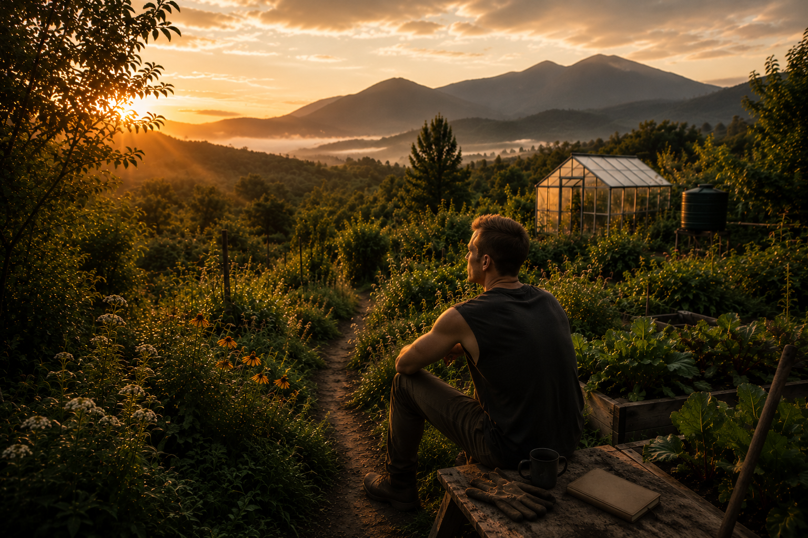

# Zen and the Art of Nomad Farming

<section class="ew-page-hero" aria-label="Zen and the Art of Nomad Farming">
  
  <div class="ew-page-hero-content">
    <p class="ew-page-hero-kicker">Personal journal</p>
    <h1>Zen and the Art of Nomad Farming</h1>
    <p>Thoughts from the field: soil, weather, mistakes, observations, restoration, simplicity and the long conversation between people and land.</p>
  </div>
</section>

---

## Purpose

The rest of NoMad's Farm focuses on:

- measurements;
- crop profiles;
- soil systems;
- infrastructure;
- monitoring;
- planning;
- research.

Zen focuses on:

- observations;
- stories;
- photographs;
- lessons learned;
- failures;
- seasonal reflections.

---

## Sections

### Field Notes

Short observations recorded during work on site.

### Photo Essays

Visual documentation of soil, plants, infrastructure and landscape changes.

### Reflections

Personal thoughts about agriculture, resilience, technology, nature and long-term stewardship.

### Lessons Learned

Practical lessons gathered through experimentation.

### Failures

A dedicated archive of mistakes, unsuccessful trials and unexpected outcomes.

### Seasonal Reports

Quarterly and annual summaries documenting progress, setbacks and changes.

---

## Documentation Philosophy

NoMad's Farm treats failures as valuable data.

A failed experiment that is documented is more useful than a successful experiment that cannot be reproduced.

---

## Suggested Entry Format

```text
Date:
Location:
Weather:
Observation:
What happened:
What was learned:
Next action:
```

---

The objective is not to create a blog.

The objective is to document a long-term relationship between people, land, infrastructure and living systems.
